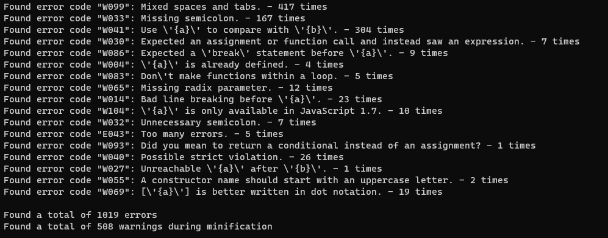

# weyland-log-parser

Parse & display information about errors and warnings found by Weyland (Durandal) optimizer.

## Description

In order to fix a lot of errors and warning that is using weyland to build the frontend code, this tool parses the logs resulted from the build process and groups the errors into a quick view:

This view helps to identify the type of errors and the total count.

## Steps

1. Run weyland and store the logs in a file: `weyland build -v 2> build.log`
2. Copy the `build.log` file in the `src\WeylandLogParser` directory
3. Run the tool from Visual Studio
